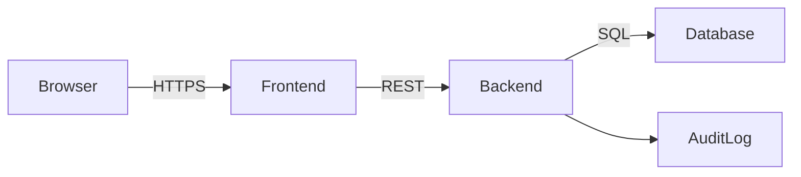
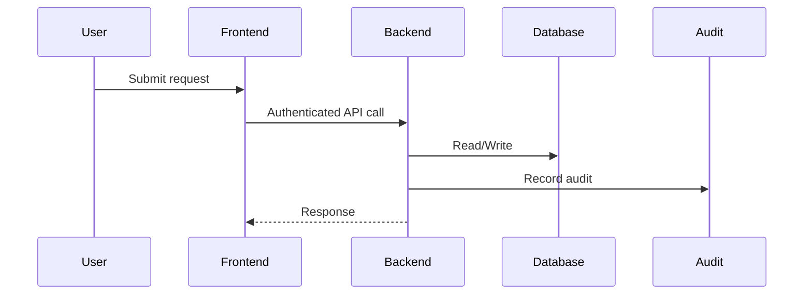
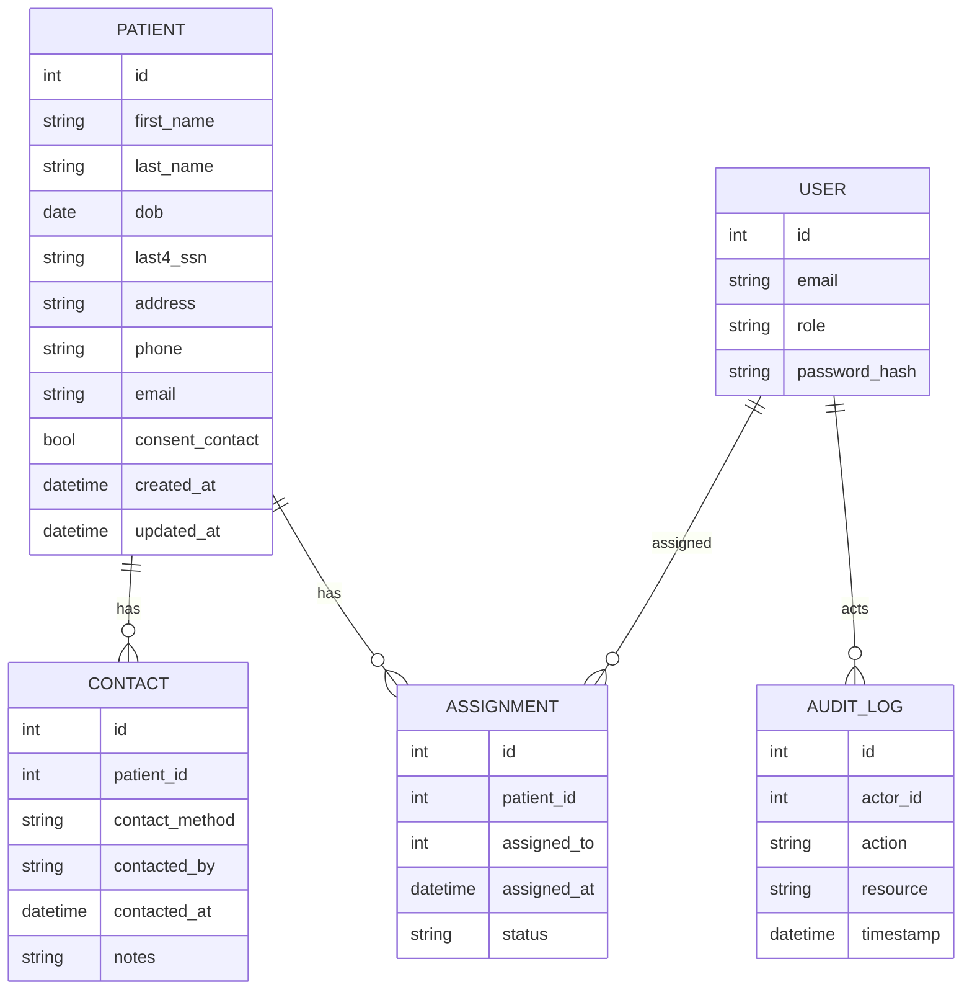

# Architecture

## Overview
The application uses a FastAPI backend with a PostgreSQL database and a React frontend.
Authentication can be provided by an external OIDC provider. All network traffic uses TLS.

## Data Flow (Sequence)

## ER Diagram

## Security Notes
- Role-based access (Admin, Care Coordinator, ReadOnly).
- Only last4 SSN stored; full SSN encrypted if ever required.
- At-rest encryption via database features (e.g., pgcrypto) and volume encryption.
- Secrets stored in environment variables and rotated regularly.
- Access logs omit PHI.
